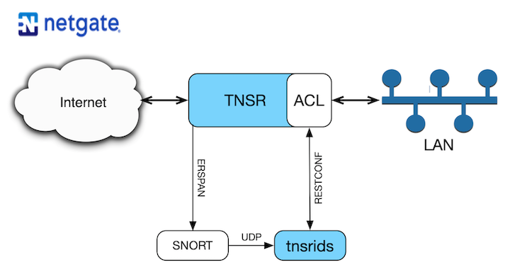

# TNSR-IDS Project
## Introduction
Netgate's TNSR is a high-speed packet processing engine. It enables secure networking at speeds up to 100+ Gbps - at a fraction of the price of proprietary alternatives. You can learn more about TNSR here: https://www.netgate.com/products/tnsr/

This project was developed as a solution to those deployments where 'wire speed' was not possible because the IDS/IPS consumed too much CPU on the firewall. IPS vs firewall need not be a zero-sum game.

As a software-defined device, TNSR operations are defined by YANG models and it is configured either from a CLI or NETCONF/RESTCONF APIs.

The tnsrids project demonstrates remote configuration via RESTCONF by automatically adding Access Control List (ACL) block rules in response to alert messages received from an instance of Snort running in intrusion detection mode.

## Setup
ERSPAN is configured to forward a copy of all WAN port traffic to SNORT. SNORT analyzes the traffic and produces alert messages in syslog format when intrusions are detected. Those alert messages are tramsmitted to tnsrids which emulates a syslog server, listening on a configurable UDP port.

When tnsrids receives an alert message, the source IP address is extracted and a new ACL rule is constructed to block traffic from that source. The program then installs the rule in the TNSR ACL causing traffic from that source to be blocked.

The block rules added in this way have a lifetime of 60 minutes (configurable) and are automatically deleted after that time

tnsrids/TNSR/SNORT can be used in several topologies: All on one machine, each on a different machine, multiple instances of SNORT all feeding the same tnsrids, or any permutation thereof.

Instructions for setting up TNSR and SNORT to accompany tnsrids can be found here: [tnsr_snort_setup.md](tnsr_snort_setup.md)

## References
* SNORT: https://www.snort.org
* ERSPAN: https://packetpushers.net/erspan-new-favorite-packet-capturing-trick/
* RESTCONF: http://sdntutorials.com/what-is-restconf/
* YANG: https://en.wikipedia.org/wiki/Yang

# Use and Configuration of tnsrids

## Running
Several command line switches are supported:
* `-v`    Verbose mode. Outputs useful (maybe) messages while running
* `-p`    UDP port to listen on for Syslog messages (Defaults to 12345)
* `-h`    Specify TNSR RESTCONF address (Defaults to localhost)
* `-c`    Configuration file location (Defaults to /etc/tnsrids/tnsrids.conf)
* `-m`    Maximum age of added rules in minutes before deletion (Defaults to 60, 0 = never)
* `-show` Display the current ACL in table format and quit
* `-reap` Delete ACL rules older than <configured> minutes (default=60)
* `-ca`   TLS Certificate authority file path (Defaults to /etc/tnsrids/.tls/ca.crt)
* `-cert` TLS Certificate file path (Defaults to /etc/tnsrids/.tls/tnsr.crt)
* `-key`  TLS key file path (Defaults to /etc/tnsrids/.tls/tnsr.key)

## Configuration file
Several options may be set via configuration file. The default location is **/etc/tnsrids/tnsrids.conf**, but that can be overridden on the command line with the `-c` switch

Currently these values may be set. More will follow:
* `host` (location of TNSR instance - including protocol)
* `port` (UDP port to listen on)
* `maxage` (Maximum age of rules before they are reaped, 0 = never)
* `ca` (Location ofcertificate authority file)
* `cert` (Location of TLS client certificate)
* `key` (Location of TLS key)

The configuration keys are case insensitive. See the sample tnsrids.conf for more details

When a configuration value is provided on the command lilne AND in the config file, the command line wins.

## Building
### To build natively
    go build
    
### To cross-compile:
    GOOS=linux GOARCH=amd64 go build

Or other OS/architectures as needed. A list of available target OS/ARCH can be found here: 
https://gist.github.com/asukakenji/f15ba7e588ac42795f421b48b8aede63

### To build without debug info or labels
Append `-ldflags "-s -w"` to the build command

## Required external packages
Two external packages are required.
* github.com/robfig/cron
* gopkg.in/natefinch/lumberjack.v2

[Cron](http://github.com/robfig/cron) provides timed execution (obviously) and [Lubmerjack](https://gopkg.in/natefinch/lumberjack.v2) provides log rotation and pruning.

## Installation
**tnsrids** can be run as an application or a service. To install it as a service, copy **tnsrids** to **/usr/local/sbin**,
copy the file **tnsrids.service** to **/lib/systemd/system**, then type:

    sudo systemctl enable tnsrids
    sudo systemctl start tnsrids

## Firewall considerations
TNSR version 19.02 and later ships with nftables enabled and configured. A rule MUST be added to allow TNSR-IDS to receive the UDP datagrams
produced by Snort. Specifying the UDP port you have configured TNSR-IDS to listen on (12345 used in this example) add a rule like so:

    sudo nft add rule inet tnsr_filter tnsr_input_mgmt_default udp dport 12345 accept

You can verify that the rule has been added by listing all tables:

    sudo nft list table inet tnsr_filter -a

## TLS authentication
Best practices dictate that TLS authentication is used to connect to the TNSR RESTCONF interface. Three files are required to authenticate in this way: A certificate authority, a client certificate and a key. The location of those files may be specified in the config file or on the command line. The default location is **/etc/tnsrids/.tls/** - The full path and filename is required for each file.

If tnsrids is running on the same machine as TNSR TLS authentication may not needed. In that case, specifying a TNSR address with "http://" rather than "HTTPS://" will disable TLS negotiation

## Testing
The command `go test -v` will exectute the program unit tests (in **tnsrids_test.go**) - Tests are provided for various utility functions. It would be possible to provide Go tests for the network pieces too, but "standard" test tools such as cURL and netcat are simpler and "standard" is a good thing.

## Running tnsrids in a Docker container
There are a number of ways in which tnsrids can be run in a Docker container. These include:
* Include all of the resources required by tnsrids (config file and certificates) in the Docker image
* Leave the resource files in a directory on the host machine, mounting the directory inside the container and passing in configuration options via command line options

### Inclusive method
The "include the resources in the image" method is the most simple. Assuming that Docker has been installed on the host system (`sudo yum install docker` or equivalent), perform the following steps:
1. Build a copy of the tnsrids utility for a Linux target `GOOS=linux GOARCH=amd64 go build tnsrids`
2. Create a directory to hold everything required by the Docker image and place the following files therein:
   * The newly built Linux tnsrids
   * The configuration file tnsrids.conf
   * ca.crt
   * tnsrids.crt
   * tnsrids.key
   * The file Dockerfile_inclusive from this repository, whuch MUST be renamed to simply "Dockerfile"
3. Now change directories to the new directory and build the Docker image with `docker build --tag tnsrids .`

**IMPORTANT NOTE**
The file names used for the configuration file, ca, certificate and key must all match the names used in the Dockerfile and in the configuration file.

To run the Docker image use the command `docker run -p 12345:12345/udp tnsrids:latest` where the published port corresponds to the UDP port in the tnsrids configuraion file.

### Host based configuration
1. Build a copy of the tnsrids utility for a Linux target `GOOS=linux GOARCH=amd64 go build tnsrids`
2. Create a directory to hold everything required by the Docker image and place the following files therein:
   * The newly built Linux tnsrids
   * The configuration file tnsrids.conf
   * ca.crt
   * tnsrids.crt
   * tnsrids.key
   * The file Dockerfile_host from this repository, whuch MUST be renamed to simply "Dockerfile"
3.  Edit the Dockerfile changing the location of the certificate, ca and key files to /mnt/tnsrids
4. Now change directories to the new directory and build the Docker image with `docker build --tag tnsrids .`

To run the Docker image use the command:
 `docker run <path to new folder on host>:/mnt/tnsrids -p 12345:12345/udp tnsrids:latest tnsrids -c /mnt/tnsrids.conf` 

 This command tells Docker to mount the directory you made inside the container as /mnt/tnsrids and then to read the configuration file from that directory.

 ### Running a Docker container as a service at start-up
 Please refer to this [Red Hat systemd guide](https://access.redhat.com/documentation/en-us/red_hat_enterprise_linux_atomic_host/7/html/managing_containers/using_systemd_with_containers)
 The tnsrids-docker.service file in this repository is correctly configured per the website example

